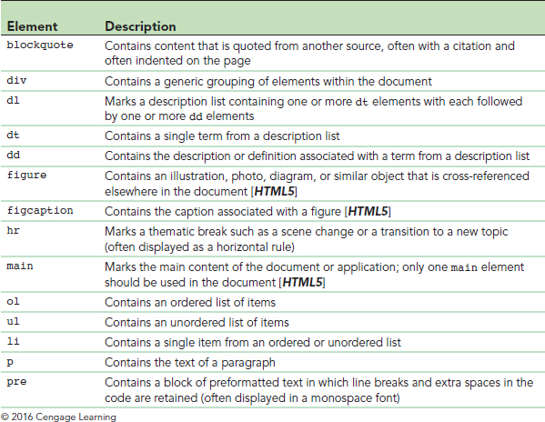

HTML
===

Contents
---
1. [Getting Started](#getting-started)
1. [Basic Structure](#basic-structure)
1. [Element Attributes](#element-attributes)
1. [Document Head](#document-head)
    1. [Metadata](#metadata)
1. [Body Elements](#body-elements)
    1. [Sectioning Elements](#sectioning-elements)
    1. [Grouping Elements](#grouping-elements)
        1. [Blocks](#blocks)
        1. [Lists](#lists)
    1. [Text-Level Elements](#text-level-elements)
        1. [Hypertext Links](#hypertext-links)
    1. [Character Sets and Special Characters](#character-sets-and-special-characters)
    1. [Embedded Elements](#embedded-elements)
        1. [Images](#images)
    1. [Empty Elements](#empty-elements)
1. [Mobile Web Design](#mobile-web-design)
1. [HTML Forms](html-forms) 
1. [References](#references)

---

Getting Started
---
HTML stands for HyperText Markup Language.

Uses a client/server model to make requests to a [web server](webserver.md) over http which returns HTML to a [browser](web-browsers.md) (the client).

Your browser understands how to render content on a page.

Traditionally, HTML is a static page. Your browser does not maintain a connection to the server. It makes a new request for each page you visit.

[HTML](#) tells the browser **what** to display. [CSS](CSS.md) describes **how** it should look. And, [Javascript](Javascript.md) makes the content **interactive**.

You can use any [server-side language](READMe.md) you want to render HTML/CSS/Javascript to the browser or serve up static HTML pages. Alternatively, the browser can render HTML pages stored on the local filesystem.

You can create and edit HTML/CSS/Javascript files with any [text editor](text-editors.md), but you may prefer a more advanced text editor with syntax highlighting and auto-completion.

The basic building block for an HTML document is an opening tag, `<element>`, and a closing tag `</element>`. Check out the [Mozilla Developer Network HTML Reference]() for a complete list of elements. All content in an html document is surrounded by an element's opening and closing tag. This is what we refer to as **syntax**. Elements can be nested, but the closing tags must appear in the reverse order of the opening tags. Note that there are some tags that do not have a closing tag. These tags have special meanings and your browser knows what to do with them by convention.

There have been a handful of revisions to the HTML standard, but know that the current is HTML5 and basically we agree that there are conventions which require less custom configuring. The standards are managed by the [World Wide Web Consortium (W3C)](https://www.w3.org/)

A unique feature of an HTML document is that you can view the source and, in addition, many popular web browsers offer the ability see the source side-by-side with the rendering. This "inspector" view is one of the most useful features in web development.
 
---

## Basic Structure
This is the basic structure of an HTML document. If any of these tags are missing, they will be filled in automatically by your browser.

HTML does not render white space, but formatting with indentation and line breaks is helpful for human readers.

```html
<!doctype html>
<html>
<head>
    <!-- head content -->
</head>
<body>
    <!-- body content -->
</body>
<html>
```
You can use comments to label different sections of your documents. Comments are not rendered by the browser, but can be viewed by looking at the source of the document.

---
## Element Attributes
Within each element tag you can specify modifiers known as **attributes**.


The most common of these are the `id`, `class`, and `style` attributes. In addition to element names, `id` and `class` act as selectors when applying CSS styles. The `style` attribute allows you to apply an in-line style to only the selected element.

You will also find that some third-party frameworks add custom attributes to identify elements.
```html
<body>
    <div id="newDiv" class="myStyle" style="">
        content
    </div>
</body>
```
---
## Document Head
Elements in the document head are not displayed by the browser, but rather tells the browser about the document that it will display.


You will likely find each of these to be common HTML elements.

Javascript and CSS styles can be provided in the `head` element and will apply only to that one document, while it might be more convenient to link to an external file to use them across multiple documents.

### Metadata
Metadata is used by other software, like search engines, to describe a document. Notice things like the language encoding and keywords.


```html
<head>
    <meta charset="utf-8" />
    <meta name="keywords" content="comma, separated, list of words" />
    <title>Page Title</title>

    <!-- external links -->
    <link href="path/filename.css" rel="stylesheet" />
    <script src="path/filename.js"></script>

    <!-- document styles and scripts -->
    <style>
        /* CSS styles */
    </style>

    <script>
        // javascript
    </script>

</head>
```
Pay attention to the link to an external CSS file as different than linking to a Javascript file. `href`  stands for Hyptertext REFerence and is similar to the common attribute for the `a` element.

---
Document Body
---
All of your content goes in the `body` of the document. The primary focus of HTML has become the "content" of a document, instead of how it looks. In fact, you will find that CSS makes it easy to change the look of the document for different factors, such as screen size or a site redesign, while keeping the content the same.

### Sectioning Elements
The original design elements for HTML were `div` and `p` elements. HTML5 has standardized some of the more common elements of HTML documents and are listed below:


These are what they call **semantic** elements. This is how the common elements would appear in an HTML5 document:
```html
<body>
    <header>
    </header>
    <nav>
    </nav>
    <section>
        <article>
        </article>
    </section>
    <aside>
    </aside>
    <footer>
    </footer>
</body>
```
Having an organized structure can aid in readability for your users and allows search engines to parse the content and lead to a higher ranking in search results.

### Grouping Elements
Group elements are the next level of organization inside a section.



These can further be divided into block groups or list groups.

#### Blocks
`blockquote`, `div`, `figure`, `p`, and `pre` elements are essentially the same, but have different default formatting properties based on their sematic meaning to the browser and are usually not nested within each other.

#### Lists
Lists provide a common structure for organizing content, but are made up of multiple tags that **must** appear in a specific order.

An `li` element is a single list item, but has no meaning outside of an `ol` or `ul` element, meaning ordered list and unordered list. These are commonly used for navigational menus and you can change the default list styling with CSS. Lists can be nested to create an indentation hierarchy.

```html
<nav>
    <ul>
        <li>Item 1</li>
        <li>Item 2
            <ul>
                <li>Sub Item 1</li>
                <li>Sub Item 2</li>
            </ul>
        </li>
        <li>Item 3</li>
    </ul>
</nav>
```

A description list is similar to the ordered and unordered list, except that the identifier is usually text instead of a bullet or a number followed by the description. The `dl` element is the outer element surrounding the `dt` and `dd` elements, and have no meaning outside of this usage.

```html
<dl>
    <dt>term1</dt>
    <dd>definition1</dd>
    <dt>term2</dt>
    <dd>definition2a</dd>
    <dd>definition2b</dd>
</dl>
```

### Text-Level Elements
Text-level elements give you additional control of the display for text content.


#### Hypertext Links
In addition to the presentation of content in a document, linking documents together is a common feature of HTML. You do this with the `a` element.

Text links usually appear as a different color and with an underline to identify it to the reader as a clickable link.

It is best to use relative URLs when referencing files within the same directory structure as the linking document.

```html
<a href="url">content</a>
```
The content of a link can be made up of any other HTML elements like an image, for example. Anything between the opening and closing tags become a clickable link.

##### Internet and Other Resources
Browsers can identify various resources by the scheme of the URL.


An http resource has the standard form:
```
http[s]://server/path/filename#id
```
##### Hypertext Attributes


### Character Sets and Special Characters
Since some characters, such as quotes, greater than and less than symbols, and even spaces have special meaning in HTML, a special code is required to display them literally in an HTML document.

These are referred to as **HTML entities** and are a string that begins with an ampersand and ends with a semicolon, such as `&lt;` or `&gt;` for the respective less than and greater than symbols. The can also be referenced by their Unicode number.

See Mozilla's [HTML Entities Reference](https://developer.mozilla.org/en-US/docs/Glossary/Entity) or the [Official list of character entities](https://html.spec.whatwg.org/multipage/named-characters.html#named-character-references) for a more complete list.

### Embedded Elements

Aside from text, it is common to include multimedia elements such as images and even video or audio.


#### Images
Images are displayed inline with text and are the size of the linked image by default. Alternatively, you can specify a different size with the `width` and `height` attributes. The `alt` text is required by the W3C standard and provides the text of the image to screen readers or if the image is not available.
```html

```

### Empty Elements
Empty elements do not contain any content, such as line breaks or a horizontal line.
```html
<br /> <!-- line break -->
<wbr /> <!-- word break -->
<hr /> <!--horizontal line -->
```

---
Mobile Web Design
---
---
HTML Forms
---
---
References
---
Carey, Patrick M. [New Perspectives HTML5 and CSS3: Comprehensive, 7th Ed.](https://www.cengage.com/c/new-perspectives-html5-and-css3-comprehensive-7e-carey/9781305503939/). Cengage Learning. 2018.

Mozilla Developer Network. [MDN HTML: Hypertext Markup Language
 Reference](https://developer.mozilla.org/en-US/docs/Web/HTML).