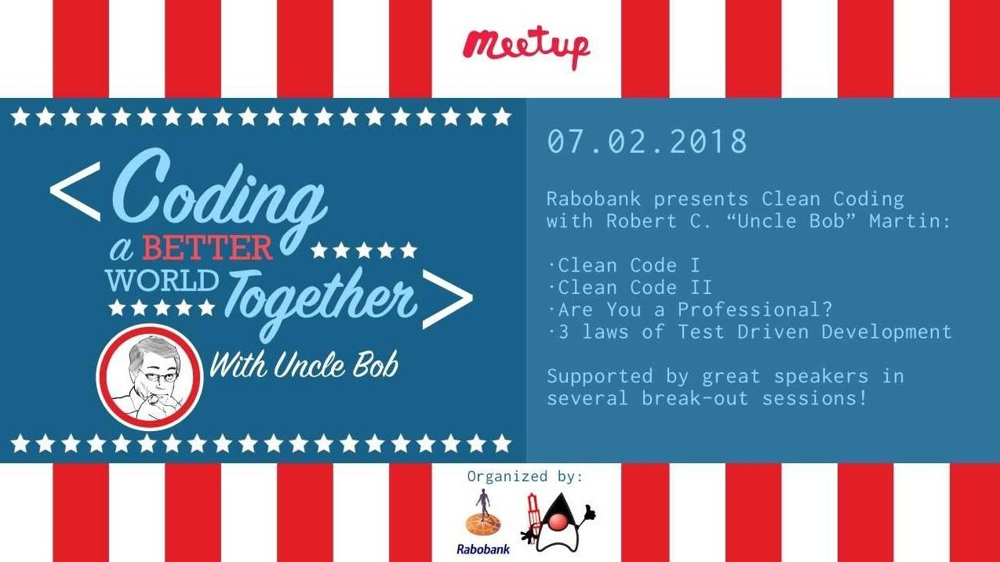
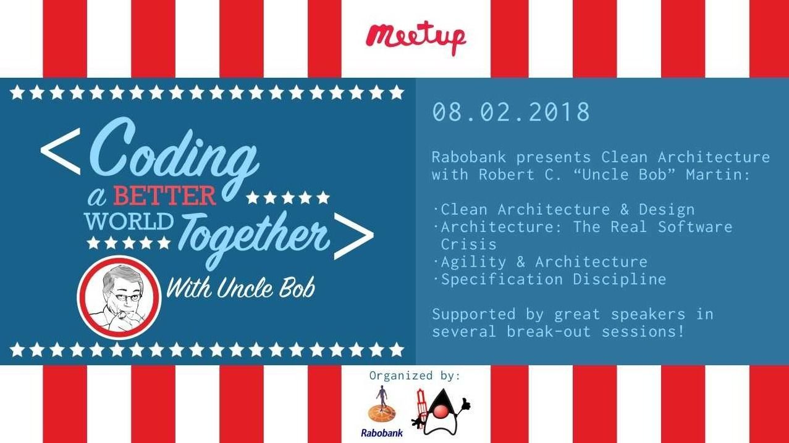

# Clean Coding with Uncle Bob

[Lesson 1](#lesson-1): https://www.youtube.com/watch?v=7EmboKQH8lM 
[Lesson 2](#lesson-2): https://www.youtube.com/watch?v=2a_ytyt9sf8 
[Lesson 3](#lesson-3): https://www.youtube.com/watch?v=Qjywrq2gM8o 
[Lesson 4](#lesson-4): https://www.youtube.com/watch?v=58jGpV2Cg50 
[Lesson 5](#lesson-5): https://www.youtube.com/watch?v=sn0aFEMVTpA 
[Lesson 6](#lesson-6): https://www.youtube.com/watch?v=l-gF0vDhJVI 

As a playlist: https://www.youtube.com/watch?v=7EmboKQH8lM&list=PLUxszVpqZTNShoypLQW9a4dEcffsoZT4k

Seem to be taken from the original live stream: 
Day 1: https://www.youtube.com/watch?v=SVRiktFlWxI 
Day 2: https://www.youtube.com/watch?v=qnq9syXUuFE

- Streamed live on Feb 6, 2019 and Feb 7, 2019
- Something is off with dates since they differ from these Meetup events at the same time.
- The graphic has 2018 as the year, but Meetup lists 2019.

## Coding a Better World Together

Day 1: [Rabobank & Utrecht JUG present: Clean Coding with Uncle Bob (free)](https://www.meetup.com/Utrecht-Java-User-Group/events/257794733/)

Day 2: [Rabobank & Utrecht JUG present: Clean Architecture with Uncle Bob (free) Day 2](https://www.meetup.com/Utrecht-Java-User-Group/events/257794904/)

Thursday, February 7, 2019 & Friday, February 8, 2019

What is clear is that it was a free event organized by the Utrecht Java User Group and Rabobank and held at the Rabobank Auditorium in Utrecht, Netherlands and streamed to YouTube.

### *Each of the quotations could be turned into a checklist for reviewing code.*

## Lesson 1

### [0:00   ](https://www.youtube.com/watch?v=7EmboKQH8lM&t=0s)    Event Presentation
- Uncle Bob has his own intro video or just special for this event?

### [2:03   ](https://www.youtube.com/watch?v=7EmboKQH8lM&t=123s)    Presenter Introduces Uncle Bob
- https://www.amazon.com/Robert-C.-Martin/e/B000APG87E
- Developer for more than 40 years.
- Agile Manifesto
- Agile has been taken hostage by consultants and developers should value craftsmanship.

### [3:41   ](https://www.youtube.com/watch?v=7EmboKQH8lM&t=221s)    Uncle Bob Introduction / My Tribe
> If you are a programmer, you are part of my tribe. 
> Share a passion for something and communicate about it.

### [4:49   ](https://www.youtube.com/watch?v=7EmboKQH8lM&t=289s)       How Far is the Sun?
> 8 light minutes 
> 150 million kilometers
#### [Aristarchus of Samos](https://en.wikipedia.org/wiki/Aristarchus_of_Samos) - Greek Astronomer
- Measure the angle of the sun with moon at a right angle from earth, then calculate distance (Trigonometry)
- Distance to the moon during lunar eclipse.
    - How long does moon stay in Earth's shadow? 3 hours.
    - How long does it take to revolve the Earth? 28 days.
- [Eratosthenes](https://en.wikipedia.org/wiki/Eratosthenes) - 30 years later
    - Calculated size of Earth by measuring angle of a stick.
- Sun is 10 Million miles away - off by a factor of 10.
- Best measurement for 2000 years (1630 AD)

### [10:52  ](https://www.youtube.com/watch?v=7EmboKQH8lM&t=652s)   Introduction to Clean Code
- 2 - 90 minutes sessions

### [12:21  ](https://www.youtube.com/watch?v=7EmboKQH8lM&t=741s)   The current Society works with Software
- Processors everywhere!
- Over 100 million lines of code to drive a car.
> There are "if" statements in the way.
- Society doesn't yet know how much it depends on software?
> We rule the world

### [19:47  ](https://www.youtube.com/watch?v=7EmboKQH8lM&t=1187s)   Volkswagen case / Introduction to the Ethics of Software Development
- kill 10,000 people with a software error.
- CEO blames software developers, for "some reason"
    - software developers in jail?
    - https://www.nytimes.com/2017/08/25/business/volkswagen-engineer-prison-diesel-cheating.html
- We don't have a profession based on ethics and standards, but concern that ethics will be forced on developers.

### [24:28  ](https://www.youtube.com/watch?v=7EmboKQH8lM&t=1468s)   Why are Programmers so slow?
- Kent Beck - Implementation Patterns
    - Fragile premise, that good code matters.
- Greenfield project - a project with no code. Initial coding happens fast.
- As the mess builds the team gets slower, and slower.
- What do you do as a manager?
    - add more people?
    - Who is training the new people?
        - not just old people, but old code
> Programmers are slow because they make a mess.

> If you could keep the code clean, it wouldn't be a mess.
- Messes are made from the desire to code quickly.
> The fact that you got the code working, that is only half the job. Next you have to clean it.
- Invest roughly the same amount to clean as it did to write it.
- Bob has slides, but doesn't use them. He always usually wings it anyways.
    
### [32:13  ](https://www.youtube.com/watch?v=7EmboKQH8lM&t=1933s)   What is a Clean Code?
#### Bjarne Stroustrup - Inventor C++
- What does clean code mean to you?
> Clean code does one thing well.
- This one thing well idea has been around forever since the Unix world.

#### Grady Booch - Chief Scientist at Rational - book 1980s on Object Oriented Design
> Clean code is simple and defined. Clean code reads like well written prose.

#### Michael Feathers
> Clean code looks like it was written by someone who cares.
- You must write code that other people can read and use.
> It is more important that your peers can understand your code than the computer can understand your code!

#### Ward Cunningham - Invented the wiki - Perl - 1990-something
http://c2.com
> Clean code means each routine of the code reads pretty much like you would expect it.

### [40:09  ](https://www.youtube.com/watch?v=7EmboKQH8lM&t=2409s)   Analyzing some lines of code
> Function names should be verbs, because functions  do things.

### [43:43  ](https://www.youtube.com/watch?v=7EmboKQH8lM&t=2623s)   Long code is not Good Code
> It is rude to jump between the highest level of programming to the lowest. Every line of a function should be at the same level of abstraction.

### [49:25  ](https://www.youtube.com/watch?v=7EmboKQH8lM&t=2965s)   Good Code / Refactored Function
> Explanatory variable - the only purpose of this variable is to explain the contents of the variable.
- What makes it better? 
    - smaller is better

### [52:40  ](https://www.youtube.com/watch?v=7EmboKQH8lM&t=3160s)   Polite Code / Rules for writing a news paper article
- Title, Synopsis, Detail increases with each paragraph

> It is polite to allow the reader to escape early.

### [55:25  ](https://www.youtube.com/watch?v=7EmboKQH8lM&t=3325s)   Shrunk Code / The Rules of Functions
> ### The Rules of Functions
> 1. They should be small.
> 1. They should be smaller than that.

> A function should do only do one thing. Extract, extract, extract until you cannot extract anymore.
- Create a sematic tree of functions that you can follow by name.

Intellij is the best editor out there? 
- Intellij has an extract feature.
Eclipse, vi were mentioned

### [1:00:23](https://www.youtube.com/watch?v=7EmboKQH8lM&t=3623s)  Shrunk Code / Drawing a Function
- Look at the shape of the code.
> When you extract, you will begin to identify the true object oriented structure of the code.

### [1:05:36](https://www.youtube.com/watch?v=7EmboKQH8lM&t=3936s)  When and why was Java invented?
#### James Gosling - Invented Java - Sun Microsystems
- Originally the OAK language
- The best way to sell hardware is to win the hearts and minds of the programmers.
- C# evolved from Java.

### [1:08:52](https://www.youtube.com/watch?v=7EmboKQH8lM&t=4132s)  Prose Code / Arguments
> The indent level of a function should not be greater than one or two.

> don't like to have functions with more than three arguments. 
    - if/else/switch statements are bad? 
    - really end up being function calls with arguments. 
    - if the arguments are so cohesive, why not pass them as an object?

> don't pass booleans into functions. 
    - that means the function would need to have an if statement. 
    - set the state of a switch, but don't pass boolean.

> Code that makes you do a double-take is rude. The Principle of least surprise.

### [1:16:13](https://www.youtube.com/watch?v=7EmboKQH8lM&t=4573s)  Avoid Switch Statements / Problems and Evolution of some programming languages
> Avoid Switch statements
- Use polymorphism instead

> The open/close principle. You should be able to extend the system without modifying the system.
- switch statements act as a dependency magnet so that a change means more code that needs to recompile and deploy.
- DLL - dynamically linked at runtime. Same concept as a JAR file.
- Linking was slow because of slow disk speed.
- Microsoft came up with ActiveX.
- Redeploy the GUI without redeploying the entire system.

### [1:26:15](https://www.youtube.com/watch?v=7EmboKQH8lM&t=5175s)  The Uncle Bob's wife message (funny moment)

### [1:27:22](https://www.youtube.com/watch?v=7EmboKQH8lM&t=5242s)  Output Arguments No Side Effects / Garbage Collection
> No side-effects
- side effect functions change the state of the system
- come in pairs; open/close, alloc/free
- garbage collection is a horrible hack, a crutch.
    - code is not written in a reasoned way.

### [1:32:21](https://www.youtube.com/watch?v=7EmboKQH8lM&t=5541s)  No Side Effects / Using Lambda
- Java 8

### [1:34:26](https://www.youtube.com/watch?v=7EmboKQH8lM&t=5666s)  No Side Effects / Command and Query Separation
> A function that returns void must have a side effect.

> Anything that returns a value, does not change the state of the system.

### [1:35:30](https://www.youtube.com/watch?v=7EmboKQH8lM&t=5730s)  No Side Effects / Prefer Exceptions to returning error codes
> prefer exceptions to returning error codes.
- no other code in the function besides the try block.
- never nested try/catch blocks.

### [1:37:05](https://www.youtube.com/watch?v=7EmboKQH8lM&t=5825s)  DRY Principle (Don't Repeat Yourself)
> duplicate code is sloppy

### [1:39:21](https://www.youtube.com/watch?v=7EmboKQH8lM&t=5961s)  Structured Programming / Edsger Dijkstra Vision vs Actual Vision of the programming
- Dijkstra in the Netherlands
- There's no body of knowledge 1950s
- put nuclear physicts on his marriage license because they would not accept programmer.
- GOTO is harmful. -> Fortran
- Dijkstra wanted to turn software into mathematics
- adopting well proven theorems. How do you prove software correct?
- There are some algorithms that could not be proven correct, those with unrestrained GOTO.
> Every algorithm can be written with three structures: sequence, selection, iteration.
- Dijkstra's vision failed.

### [1:45:32](https://www.youtube.com/watch?v=7EmboKQH8lM&t=6332s)  Science and Correct Software
- Science - hypotheses can only be tested and proven false, but can not be proven true.
> Demonstrate that software is correct by surrounding by tests.
- write tests for every line of code that you wrote.
- Why would you write code and not test it? 

---

## Lesson 2

### [0:00   ](https://www.youtube.com/watch?v=2a_ytyt9sf8&t=0s)     Where did the moon come from?

### [4:56   ](https://www.youtube.com/watch?v=2a_ytyt9sf8&t=296s)     What is the Purpose of the Comment? / About Fortran
> The purpose of the comment is to explain code that cannot explain itself
- Fortran variable name length is 6 characters.
- Basic, 1 letter 1 number

### [8:47   ](https://www.youtube.com/watch?v=2a_ytyt9sf8&t=527s)     Schindler List / Right and Wrong reason to do comment
> Some comments are good.

> Some comments are bad.

### [10:02  ](https://www.youtube.com/watch?v=2a_ytyt9sf8&t=602s)    Comments are a last resort / The proper use of comments
> comments should be used when you can't properly express yourself in code.
- Every comment is a failure to express yourself. An unfortunate necessity.

### [11:02  ](https://www.youtube.com/watch?v=2a_ytyt9sf8&t=662s)    Comments Lie
> Comments lie
- they silently rot
- they degrade over time
- IDE paints comments in colors that are easy to ignore.
- make comment bright red, because figure someone wanted you to read it.

### [13:07  ](https://www.youtube.com/watch?v=2a_ytyt9sf8&t=787s)    Comments do not make up for bad code / Explain Yourself in code
> When you read a bad comment, clean the code
- put the effort into the code, not the comment

### [15:11  ](https://www.youtube.com/watch?v=2a_ytyt9sf8&t=911s)    Legal and  Informative Comments / About Design Patterns book
- Design Patterns book, singleton
- probably the most important book written in the last 30 years.
- names to old patterns
- "Visitor"

### [20:43  ](https://www.youtube.com/watch?v=2a_ytyt9sf8&t=1243s)    Explanation of Intent / Clarification
> Code is rife with optical illusions 
- sometimes drawn to comments instead of actual code, therefor ignoring incorrect code.

### [23:21  ](https://www.youtube.com/watch?v=2a_ytyt9sf8&t=1401s)    Warning of Consequences / TODO Comments
> TODO ends up being don't do
- don't check-in todo comments

### [25:59  ](https://www.youtube.com/watch?v=2a_ytyt9sf8&t=1559s)    Amplification / Javadocs in Public APIs
> only use docs for external viewers

### [27:35  ](https://www.youtube.com/watch?v=2a_ytyt9sf8&t=1655s)    Bad and Redundant Comments / Mumbling 
- talking about code in some other place, may or may not be true.
- easier to read the code
- useless comment, worse then useless

### [31:25  ](https://www.youtube.com/watch?v=2a_ytyt9sf8&t=1885s)    Mandated Comments
> When you mandate comments, you get stupid comments

> the params block is silly

### [33:01  ](https://www.youtube.com/watch?v=2a_ytyt9sf8&t=1981s)    Journal Comments / Source code control system
> No journal comments, this is the reason we have version control systems. 

> git, yeah that's the right one. lol

### [34:16  ](https://www.youtube.com/watch?v=2a_ytyt9sf8&t=2056s)    Noise Comments / Scary Noise / Use explanatory code, not comments

### [36:20  ](https://www.youtube.com/watch?v=2a_ytyt9sf8&t=2180s)    Position Markers / Closing Brace Comments / Attributions and Bylines
> Positional markers used to be important, but now we have IDE with bracket matching, etc.

### [37:43  ](https://www.youtube.com/watch?v=2a_ytyt9sf8&t=2263s)    Commented - Out Code / HTML in comments ICK!
> Just get rid of commented out code.
- Comment out code while doing experiments, but do not check it in. 

### [40:05  ](https://www.youtube.com/watch?v=2a_ytyt9sf8&t=2405s)    Non - Local Information
> Never talk about code that is somewhere else.

> This person didn't want to write the code, they just wanted to write about the code, so they wrote a whole little essay.
- what you should be doing is making the code speak for itself.

### [41:45  ](https://www.youtube.com/watch?v=2a_ytyt9sf8&t=2505s)    How many lines should there be in a source file?
> File size is not a function of project size. File size is a style that you can impose on your system.

### [46:31  ](https://www.youtube.com/watch?v=2a_ytyt9sf8&t=2791s)    Analysis of the lengths of lines
- Box diagram of length of files
- Histogram of length of lines
    - FitNesse
    - JUnit
    - TestNG
    - TaM
    - tomcat
    - ant
    - jdepend
- Nobody wants to see lines longer than about 80.
- bigger screens not a factor on line lengths.
> It is rude to make your reader scroll to the right.
- line at 150

### [50:11  ](https://www.youtube.com/watch?v=2a_ytyt9sf8&t=3011s)    Names are Everywhere / Reveal your intent / Rules to write Names
- files, directories, programs, classes, variables, arguments, 
> Because we do so much naming, we ought to be good at it!

> ### Rule for length of variable name 
> The length of the variable name should be proportional to the scope that contains it.

> ### Rule for length of function name 
> Exactly the opposite of rule for variable name.
> The  length of the function name is inversely proportional to the scope that contains it.
- high level of abstraction should have short name.

> ### Rule for length of class name 
> Same as rule for function name.
- Base class is one word. Derived class is two words.

### [58:44  ](https://www.youtube.com/watch?v=2a_ytyt9sf8&t=3524s)    Disambiguate / Avoid Convenient Mispellings
> Fight against optical illusions

### [1:00:41](https://www.youtube.com/watch?v=2a_ytyt9sf8&t=3641s)   Number Series / Noise Words / Distinguish Names Meaninfully
> Data and info are noise words

### [1:02:55](https://www.youtube.com/watch?v=2a_ytyt9sf8&t=3775s)   How much time should you spend on a Code Review?
- pair programming allows you to share knowledge.
> Code review is inefficient, pair programming is efficient

> Code review takes roughly the amount of time it took to write the module.
- pair programming is authoring

## Lesson 3

## Lesson 4

## Lesson 5

## Lesson 6